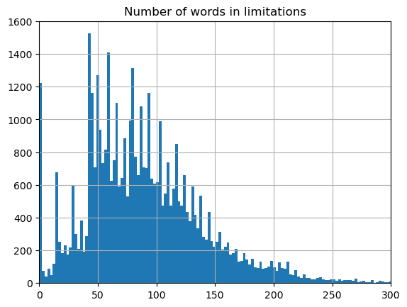

# A NLP project on FAA documents

## Abstract
This is a personal NLP project dealing with FAA documentation. This included use case definition, data source identification, data collection, data cleaning, data mining, RAG and LLM fine-tuning.

Retrieving data from FAA DRS proved to be very convenient and FAA NLP data is high quality. 
While LLM now accept long token

# Introduction

## Motivation
While aviation is a heavy producer of documentation, most of the aviation-related database publicly available on popular ML websites (kaggle, huggingface, google data) is about unformatted tabular data and not about NLP (e.g. accident rates, airport traffic, helicopter types). On the contrary legal has a few datasets available.

This is quite remarkable knowing the effort of the US administration to set up API

plus while innovation takes time to translate to aviation (aout 10 yeeags from cusomer to aviation), aviation has been an early adopter of mass data cpllectoipn anbd procession (e,.g. CVFDR, telemetryu).

Talk about SAE SG-34.

While most fot he aviation data has been already available from the regualtor's webiste, data collection was not straigforward.

FAA has recently a moderm platform to browse all the publicly available FAA documentation: https://drs.faa.gov/. This platform offers tremendous capabilities and offers an API (one of the many DOT platforms to offer this) to programativalyy acces its docuymentation.
Non gov platforms like AHST offer also high qulity and formatter, but haev no API.

## Why aviation data
I currently work in aviation, the starting block of any ML project (and actiually SW dev proect) is to get to intimately know the data. Since I work in aviation, I've a professional interest in knowing more about all types of documents and contant that the FAA (or its representatives) produces. I my self consumes and produces avation documentation.

Availabilty of datasets opluly avaialble has always been a proof of maturiyty.

From a ML perspective, aviation data offers lots of benefits:
* it's more available. To the limit of business protection, there is an obivous benefit in sharing knowkledge.
* generally avitation data is formatted and of good quality (not so much with operational data). 
  * formatted: FAA forms
  * quality Order_1000.36 FAA WRITING STANDARDS. This is th eequivalient of pytonhic manific (but more).

Parler aussi du fait qu il y a des qa tables nd a lors des sollicitations.

Big emphasis on traceabiliuty and compluiacn, which structuraly produces high quality data (compares to pretty much anything else) with lots of metadata.

CONS: lots of temporal drifts: e.g. 41-14 starts with.. wood. Still relevant, but meh.
also not as many specific ex am-le as github repos.

## Methods and tools

# Data Collection

## Results on data collection
The whole project in written in Python.

For data scrapping:
1. Get familiar with the API: https://drs.faa.gov/help/helpdetails
2. Download the DRS Document Types Metadata Mapping file from https://drs.faa.gov/help/helpdetails
3. Collect the index table for each DRS doc type
4. Collect each file or text from each document found in each index table

This is pretty straghtforward except for several highpucs:
1. DRS changed a little bit, forcing me to adapt my file collection code
2. Some files caused some issue (files with special characters like &)
3.  The data scrapping portion relies on Selenium. After some times my IP address got banned, so I started using a VPN to finish my data collection

olllama

lmsutio

oparler de la quantiti'e de fichier, noom,bre de mots,,,

get high livel info on all data collected

Other FAA data: DER training.

## Other sources of data with good formatting
The following data could also be an excellent source of data for an NLP project:
* public comments are organized as Q&A tables. There are generally very nicelly formatted so that a tabular extrator libraty should work (somethinmes alswer formatted in csv like files). The address pretty much all the time complex questions (referrence to other FAA documents or industry practive). The answer provided by the FAA is not "right" like what can be found in other factual Q&A databse, but the clarify the intent of a guidance.
* 
As I was exploring the different 

Q&A: 

omcodemt data

unexploite good source of data

# Exploring the data

## First shot: STC

I know it very well

small, well documented

well structured

long timeline

diovesity

20

Number of STCs = 76416
Number of STCs with pdfs = 43818

very few abnormal dates (<50)

very very few c

this distrobutio0n applies all the time: STCs by stcProductSubType from

does not reflect the money 

large multiengine haev a differetntdistributuion

by STC holder: drift over the years. comnany name change ()

16

22

### Why STC certificates

### Metadata only

### Adding text content

#### metadatA only

recap of what I did plpt

findings

* check dates all dates
* check missing data, only somne fields
* check coherence between drs:status and drs:stcStatus
* check choehrence between drs:stcProductType and drs:stcProductSubType

* Basic statitics to see balance: # STC (drs:chronicleId) vs. 
  *  holder (drs:stcHolder)
  *  type of part (drs:stcProductType)
  *  primaryRespOffice (drs:primaryRespOffice)
  *  time (drs:stcStatusDate drs:stcAplicationDate  docLastModifiedDate)
  *  stcProductType (drs:stcProductType)

SA00765DE pdf is broken. Just one!

abnormal dates... just a dizen

Number of STCs by stcProductSubType all years

Number of STCs by stcProductSubType by decade

Number of STCs by Holder all years

Number of STCs by Office all years

FW behind now

Number of STCs by Office by decade

lots of other comments possibnle, but stop here.

STC dates

last modified date is very odd

Same but by decade

Delta time between reissuances

Number of reissuances

#### text content

edecodin in google cloud platform

number os usefl (43818, 30)

pas grand chose

qques parrters = l;igne droite

interessant de' explorere les cas dans l' enveloppe

dire que c' est fait des essais avec LLM.

tuens out that it was not a good idea: why?

Reduced scope and subset of doc types 

General overview of DRS data
Getting FAA data from the DRS

Case study on STC

Some metrics

talk about the few problems in the dates

### DRS and the other non DRS documents

cite des use case

For the data .

FAA API, data and DRS

Is that suitable for nlp? Os that suitable for nlp on a personal computer?

Challenge with DRS data
What's not in FAA DRS
Getting to know the FAA DRS better

Parsibt Drs docs

Parsing non Drs docs

Is that suitable for NLP?

## ML applications

zero shot proved very innefective. I didn't try chatGPT.

fdire que je suis parti sur du RAG, car prometeur. Mais tarining sur la liste en utlisaaloxe (voir article de HN), amsi computer intesive.

j'ai fait des experienc avec LLM, mais il faut de lonuges tokes window et de la puiossance de calcul, genre 5k

apres le segmentage permet de reduide la puissance  calcul

prompt pour le llm:
qui tu es
contexte 

role: adapt role de' exper

task:  review against standard and rpviode advice

context: target audience, background information, scenario

## SAE Criteria

<!--
# TODO
* Reorganiser le cod le code
* Relancer tout
* faire la database de texte
* faire des use case?
  * classification? classification en utilisant DRS Document Types Metadata Mapping(1) => stc_collection_test_offset=1250.xlsx
  * generation?
* pdf to text avec google vision pour tous les docs
* qui limite à une certaine mod d'helico
* trouver un vrai use case avec lequel il y a un vrai pattern
* statistics on desctiption legnth (# of words)
* statistics on Limitations and Condition (# of words and sentences)
* classifier pour les ATA, avec les ATA les plus classiques
* STC content (limitations/correl;ations):
  * verifier si les deux sont anticorr'lé
  * améliore l'algo d'extraction des limitatiosn te confdisiotn
* faire rounite d'extraction de paragraphes -> 92
  * outline du pdf
  * regex https://regex101.com/
  * figures
  * si bookmark correspiond pas a un vrai titre
  * faire nested liste ou ien juste flat avec toute l'arbo...
  * faire un regex pour extraire le mocreau de texte.
  * pattern utiles pour detection de title (initial):
    * extraction de la ToC depuis pdf plnuimber
    * Excellent:
      * début de phrase
      * Phrase avec peu de mots
      * parttern tres recurent suitnt le type de doc
    * Bon marqueur:
      * En gras
      * majuscule
      * deux points
    * Moyen marqueur:
      * keyword connus
      * point final 
    * En vrac:
      * En gras
      * keyword connus
      * peu de mots
      * fini sans un point final
      * majuscule
      * saut de ligne avant, mais pas apres
      * parttern tres recurent suitnt le type de doc
      * des fois des deux points
    * Examples:
      * (6) Training on Records.
      * 21. PASSENGER AND CARGO LOADING PROCEDURES. 
      * (1) Loading, based on aircraft configuration, i.e.,....
      * 1. Purpose.
      * Purpose: This InFO informs air carriers of the availability of the Department of Transportation’s (DOT) National Aviation Resource Manual for Quarantinable Diseases. 
      * SUBJECT: DOT

## TODO:
* STC content (limitations/correl;ations):
  * refaire une analyse avec google vision sur fichiers qui ont d'econne seulement: le faire avec les filters. Se faire un fichier excel pour releceture plus simple
* Identify pdfs requiring google vision by type: STC, CAR, 
* Retrieve additional attachment (xml, html, doc, docs, xls, xlsx). Not sure since not additional info.
* faire classifier d'ATA et l'appliquer sur les STC
* identifier un use case pour le STC:
  * pas simple, pas vraiment d'apprentissage car peu de lien entre les différents paragraphes
  * OK pour statistique explicatives:
    * où est-ce qu'il y a les ICA et FMS
    * où est-ce que la hrase générique d'incompatibilité
    * lien entre ACO et ODA
    * conbien listent les ICA et FMS en lim vs conteniu du design change
    * diversité des l;imitationms listées
    * limitation à une mod d h;élico
  * faire de la génération? 
* Use case sur tout le DRS:
  * faire classifier général sur tout avec remplacement de mots
  * découper les paragraphes
  * un bon use case est de bosser sur des bons doc qui sont des guidance
* Use pour un sous-ensemble du DRS:
  * doc de qualit'e: order, AC, 
  * outline/bookmark dispo
  * doc a partir desquels on peut faire decoupage question/reponse par paragrahe
* Check compliance against 1000.36 -> needs to be translated from rules to examples.
 * peut-etre que les modeles existants permettent de faire du zero-shot dessus?
 -->