# A NLP project on FAA documents

## Abstract
This is an in-work personal NLP project dealing with FAA documentation: use case definition, data source identification, data collection, data preparation, data mining and some RAG and LLM fine-tuning.

# Introduction

## Motivation
While aviation is a heavy producer of documentation, most of the aviation-related database publicly available on popular ML websites (kaggle, huggingface, google data) is about unformatted tabular data (e.g. accident rates, airport traffic, helicopter types) and not about NLP. In the same time legal has had a several datasets available. This is quite unusual considering that aviation data is very good at producing complex, high-quality and standardized documents or more generally any sorts of communication (e.g. GAMA standards, ATC standards, Aeronautical Charts, Obstacle database).

While it takes at least 10 years for a commercial-level technology to hit aviation, data has been at the core of airborne aviation for a lot quite some times (CVFDR, telemetry...). FAA has been offering for several years a modern and powerful platform to browse all the publicly available FAA documentation: [DRS](https://drs.faa.gov/). This platform offers tremendous capabilities and an API (one of the many DOT platforms) to programaticaly acccess its documentation.

I truely encourage you to take a look at it right now since this will be the primary source of data.

Non-governmental platforms like [AHST](https://ushst.org/) offer also high quality documentation (this one on helicopter safety), but have no API.

Most of the ACs and TSOs rely on industry standards published by SAE or RTCA. Those have been excluded since they are not publicly available (and they are not cheap).

NASA standards have also been excluded since they do not stritcly belong to the same usage domain (my focus is aviation and NASA standars are almost never recommended).

I did not scrap the FAA website since I anticipate that this would be rather redundant with [DRS](https://drs.faa.gov/). Some specific items like the [Rotorcraft Issues List](https://www.faa.gov/aircraft/air_cert/design_approvals/product_issues_lists/rotorcraft) are not on [DRS](https://drs.faa.gov/).

## Why aviation data
The starting block of any ML project is getting intimately familiar with the data. Since I work in aviation (rotorcraft), I've a professional interest in knowing more about all types of documents (format and content) that the FAA produces (with a focus on rotorcrafts).

Data collection and mining is systematically overlooked in most of the ML projects ([Conway's law](<https://en.wikipedia.org/wiki/Conway%27s_law)>)?), leading to post-training issues. So starting at data collection level is an interesting exercise for airborne application.

From a pure ML perspective, aviation data offers lots of benefits:
* because of the safety constraints, aviation structuraly produces lots of data in various format 
* aviation data is diversifed (e.g. produced and consumed by people with various background) and standardized (FAA Forms\, Tech logs, ATC communication, ARINC 429 GAMA, accident reports...)
* aviation data has been around for many decades

And more specifically for the text documents released by the FAA:
* FAA offers a powerful API
* FAA documents are well formatted (Q&A tables, consistent tables of content)
* FAA documents have a high quality standard (Order 1000.36) compared to the best NLP dataset that one can find on Hugging Face. The notably natively include ["chain of thoughts"](https://arxiv.org/pdf/2201.11903.pdf)-like answers.

Overall I ended with the following datasets ([parquet](https://parquet.apache.org/) format):
* STCs with metadata, extracted description and limitations/conditions (~50MB)
* DRS with metadata (documents requiring OCR have no text) (~100MB)
* ACs, Orders with metadata and splitted paragaraphs (>1GB)

# Data Collection
## Results on data collection
DOT APIs are very easy to use and these are the steps that I followed to collect DRS data:
1. Get familiar with the API: https://drs.faa.gov/help/helpdetails
2. Download the DRS Document Types Metadata Mapping file from https://drs.faa.gov/help/helpdetails
3. Collect the index table for each DRS doc type (~ 1 hour)
4. Collect each file or text from each document found in each index table (several months)

Check [#10](./10_stc_collection.ipynb) for STCs and [#90](./90_gendoc_collection.ipynb) for all DRS.

This is pretty straightforward, but I did hit several hard points:
1. DRS website changed a little bit, so the code had to follow
2. Some files caused some issue (filename with special characters like &)
3. After some times my IP address got banned, so I started using a VPN to finish my data collection
4. On top of the main file, DRS offers also "Attachments/Public Comments" documents. As of today those are not searchable with DRS and not in the DRS Document Types Metadata Mapping file.
5. There also non-pdf and non-text files

Aeronautical Information Manual (AIM) and Aeronautical Information Publication (AIP) are two basic references in aviation. They are not in DRS, so I've added them manually to the dataset.

[eCFR](https://www.ecfr.gov) is also another great ressource (can collect dockets from there), but it is already covered in [DRS](https://drs.faa.gov/).

## Other sources of data worth exploring
The following data could also be an excellent source of data for an NLP use case, but I've not had the time to focus too much on those:
* public comments are organized as Q&A tables. They are generally very nicelly formatted so that a tabular extrator library should work (and even sometimes directly in csv format). The answer provided by the FAA is not "right" like what can be found in other factual Q&A database, but this could still be a good starting point.
* AC 43-16A - General Aviation Maintenance Alerts offers also an excelent source of maintenance database
* MMELs are also well formatted, but definitely less diversified
* FAA DER training center (learning documents and Q&A)
* all the DRS missing data and all the documents which were discontinued to exist. Identifying and explaining missing data is important for data quality and bias mitigation.

# A first try with STC (Supplemental Type Certificate)

## Why STC certificates
STC is the master document that defines the type design of an aircract modification, it's the final document (except for the PMA) that gets issued at the end of a certification project. I happen to be working a lot with STCs, so I knew that those enjoyed lots of nice properties:
* small (<1000 tokens so local LLM can be fine-tuned)
* rigid structure
* informative
* diverse
* long history 

## Metadata only (with a focus on rotorcrafts) [#20](./20_stc_metadata_exploration.ipynb)
The DRS metadadata already offers a wealth of information before even exploring the text content. I've only analysed a fraction of the metadata and the following is another fraction of this analysis. It's really a high-level analysis to get to know the data better, but I didn't push towards more complex data mining methods (dimensiality reduction, clustering... scikit-learn is the best source I know to start a ML project). Maybe something for later.

The metadata file has as many rows for an STC as there are issuances. Date of STC (re)-issuance is given by "stcStatusDate". A STC is reissued for example to add a new configuration (e.g. obsolescence). Note that a STC can be updated (e.g. minor change for editorial changed) and not reissued and in that case the latest update will be indicated in the field "docLastModifiedDate".
"drs:stcAplicationDate" corresponds to the application date for the firs STC issuance.

* Number of STC (documents):
  * indexed: 76416
  * with PDF (usable for text content analysis): 43818

* Sanity check:
  * only one broken PDF ([SA00765DE](https://drs.faa.gov/browse/excelExternalWindow/2F49BD200CEC24DD86257F5600610445.0001?modalOpened=true))
  * very few abnormal dates (<50)
  * very few headers typos for the DRS metadadata ("Document Type name in DRS ", "Deafult  Sort By")

* *Rotorcraft STCs reissuance distribution*: there is a period (which is remarkable) that is ~3 years, but looking more closely reveals that the actual period is more like 1.6 years (there is another peak around 7 years (~1.7*4)). It could be interesting to filter by ATA, company, ACO... to try to consolidate or explain this pattern. Another other interesting observation is that is period is not consitent when we switch to airplanes.

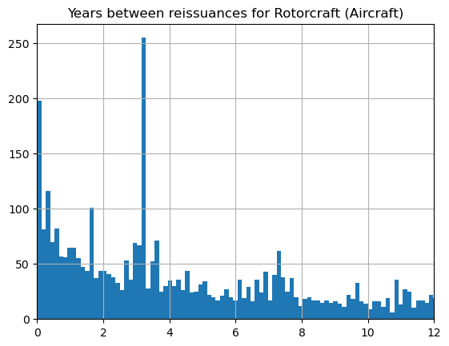

* *Number of STC re-issuance for rotorcrafts*: the majority of STCs are not reissued (but there could have been some minor changes to the type design).

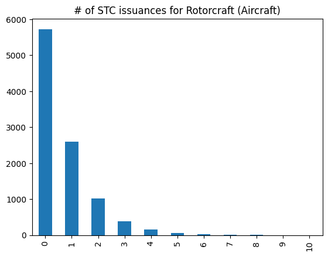

* *Number of current and historical STCs for the different FAA offices (all years)*: it's quite expected to see Fort Worth on top of the list for rotorcrafts.

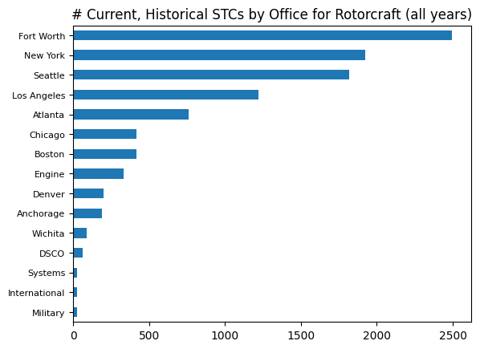

* *Current STCs re-issuance for the different FAA offices since 2020*: interrestingly Fort Worth is not on the top position while the group of other top FAA offices remains the same.

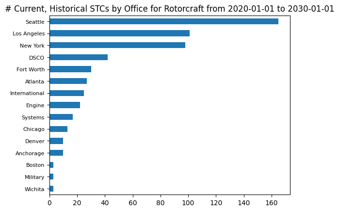

* *Year of initial applications*: I was surprised to observe that new rotorcraft STCs have only been decreasing since 2008 (US financial crisis, but it might be just a correlation). We can also see a sharp drop caused by COVID.

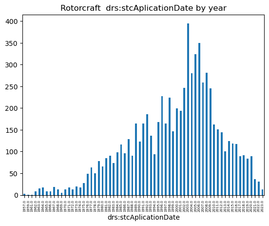

* *Year of STC reissuance*: we can still see the decrease, but it's unclear what caused those 3 peaks without drilling more into the data (probably an artifact).

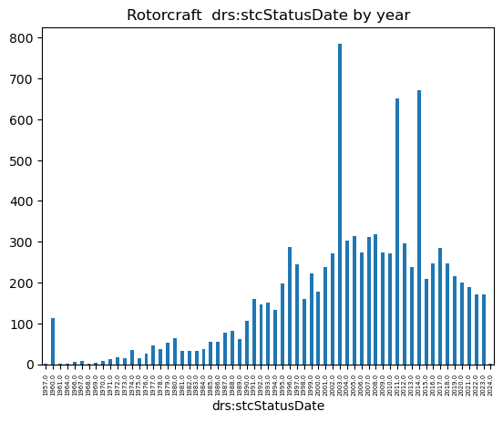

* *Application day (of the week)*: I would have expected a flat distribution, but it's interresting to see a peak at the beginning/end of the month. This might be driven by company business objectives. Harder to explain is the peak in the middle of the month.

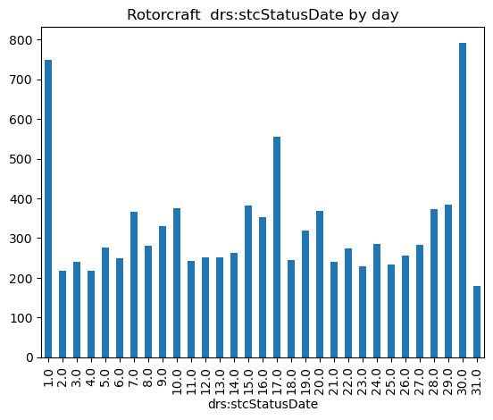

* *Application day (of the month)*: The distribution is rather flat as expected, with a sharp drop on Friday (not surprising). Most surprising is that there are a few applications on Saturdays.

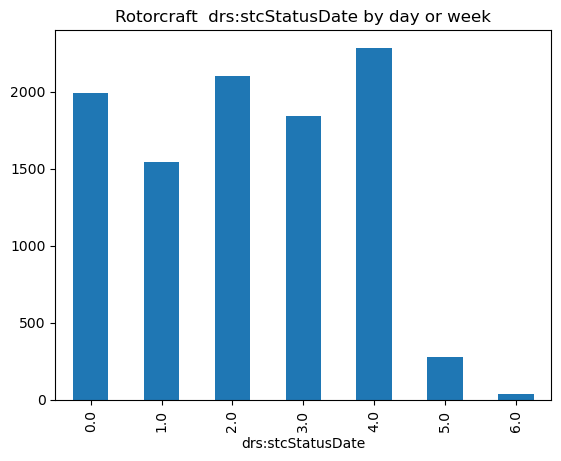

* *Helicopter STCs by holder between 1990 and 2000*: a big surprise to me was that American Eurocopter (now Airbus Helicopters, Inc.) was one of the largest issuers of STC certificates (but a detailed analysis of the STCs show that those are not complex) while still reamaining a rather small company. It's also worth noting that companies have very different business models (ODA doing work for third parties, ODA doing only internal work, companies with core products working with ACO).

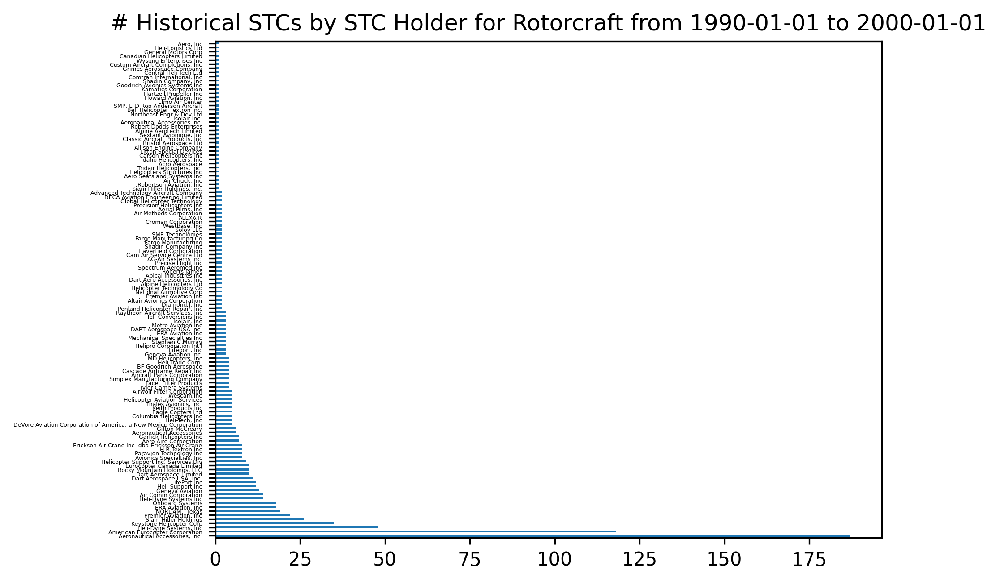

* *Historical and Current STCs*: the distribution is quite expected, but most surprising is that the distribution is not reflecting the relative weight of those markets (large multi-engine should be significantly highier).

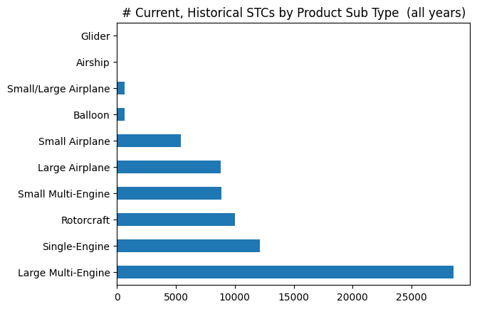

I could keep going on and on (e.g. looking at time drifts, comparing single engine vs. multi-engines, focusing on a region or on a company, crossing with other database...), but that's enough histograms for today.

## Text analysis
### Getting to know the data
STC textual data was decoded using a mix of from pypdf and PyPDF2 for pure PDF decoding and Google Cloud Platform OCR when only a scan was available.
GCP OCR proved to quite uneffective on a fraction of scanned pdfs (SA00005MC-D) yielding very odd artifacts (unable to decode some letters, paragraphs in the wrong order). GCP OCR does not offer any options to adjust performances, so the only workaround was to perform some image preprocessing (was able to improve performance).

STCs are well defined and the format has remained pretty much the same over the years. The key fields from a text standpoint are the "Descriptions" and the "Limitations/Conditions". The rest of the data is quite redundant with the metadata. Let's look at some examples first:
* accross the ages: [old](https://drs.faa.gov/browse/excelExternalWindow/BA172489A7E9DA1586257CD30047CF76.0001?modalOpened=true) , [recent](https://drs.faa.gov/browse/excelExternalWindow/DRSDOCID128075530320230314172310.0001)
* description: [short](https://drs.faa.gov/browse/excelExternalWindow/CA21490D878D3C63862574C600496658.0001?modalOpened=true), [average](https://drs.faa.gov/browse/excelExternalWindow/3FE1351336C0748F8625831400585C06.0001?modalOpened=true), [long](https://drs.faa.gov/browse/excelExternalWindow/17914C2EEDFFC8C98625804300770386.0001?modalOpened=true)
* limitations/conditions: [short](https://drs.faa.gov/browse/excelExternalWindow/DRSDOCID125280334620221128154006.0001?modalOpened=true), [average](https://drs.faa.gov/browse/excelExternalWindow/3FE1351336C0748F8625831400585C06.0001?modalOpened=true), [long](https://drs.faa.gov/browse/excelExternalWindow/EF198F621A3B2AA9862585D90044ACBF.0001?modalOpened=true)

The following two pictures show the word distributions for those two fields. Description is a Gama distribution, while Limitations/Conditions is more multimodal. That's not surprising since the Description is more formatted, while the Limitations/Conditions field is often used a field to register auxiliary information.

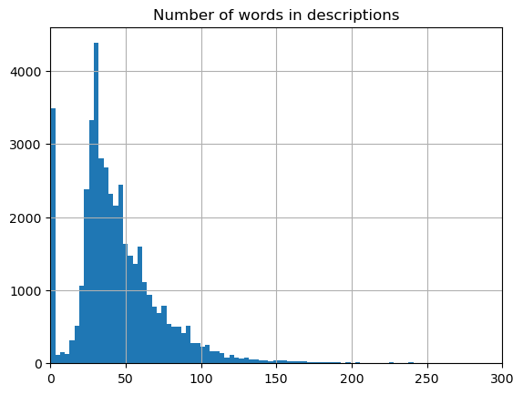

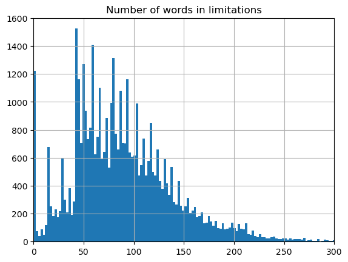

### (Lack of) Results [#22](./22_stc_content_exploration.ipynb) [#25](./25_stc_text_exploration.ipynb)
I failed to find a decent LLM application:
* zero shot using 7B LLMs (LM Studio) yielded poor results (classification: guessing meta data based on Description, Limitations/Conditions, guessing the ATA).
* ATA-classification (using DRS MMEL and JASC) performances were poor.
* Overall I could not find any interresting use cases (using [nlp book](https://www.oreilly.com/library/view/natural-language-processing/9781098136789/) as a basis).

The key problems might be that the STC Description and Limitations/Conditions are not informative enough and are quite independent between each others from the metadata (there are no patterns to learn or represent). Another problem is that the Description is often based on the commercial name of the modification/equipment, which is too much of a specific usage domain. Unlike a catalogue, it is not meant to provide a commercial description. We would need to scrap data from all STC holders, correlate the P/N with the catalogue description to have more information.

Following picture shows the lack of correlation between Description and a Limitations/Conditions. It's worth noting that there are some obvious vertical and horizontal bars. Those might be linked to "standard sentences" ([AC No: 20-188](https://www.faa.gov/documentlibrary/media/advisory_circular/ac_20-188.pdf)). There are also several cluster that could be worth exploring (same underlying pattern or pure coincidence?).

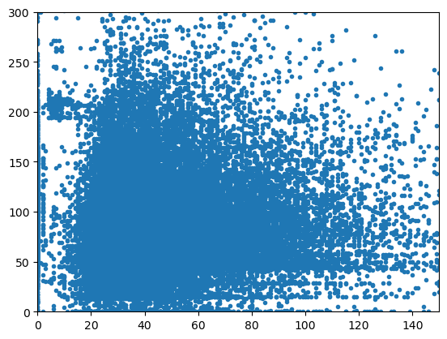

Other than that my main findings are that:
* There is some overlap between what's a Description vs. a Limitations/Conditions. For example the RFMS and ICA can be found in one on the other.
* Limitations/Conditions is sometimes used for additional configuration control.
* There is a wide variability on how those fields are used (depth of explainations).

# All DRS and the other non DRS documents

## Data collection [#90](./90_gendoc_collection.ipynb)
It took me about 3 months to collect all DRS data on my personal computer (working 1 or 2 hours before going to bed, so not a full time job), but many more months to set up a functional data collection routine. I collected all the DRS data, plus a few more (AIM, AIP). There was no signigicant difficulties, except being patient and improving the code to come up with any exceptions found on DRS (e.g. new data format, attachments, time-out, pdf crashes). 
The whole raw documents dataset (mainly pdf, but also doc, xls, html) is about 55GB.

## Getting to know the data
At the time of my data collection, there was:
* ~172799 indexed documents
* ~324805 available documents if we add the attachments. Those include a lot of redundant documents, because DRS makes available doc and html versions of some pdfs.
* ~171254 documents that can be decoded without OCR (I didn't try to OCR all the missing documents for budget reasons). Non-decodable OCR also include documents with no content (only the index is available).

This dataset is currently qui airplanes/rotorcrafts-oriented, but the FAA is adding more and more data for space travels.

The following pdf made PdfReader crash really bad, but I didn't investigate further (I just noted that those happened to be the oldest indexed FAA documents):
* [CAM 1: Supplement No. 1; New Issuance System - Change of date of CAM 1 to December 15, 1959](https://drs.faa.gov/browse/excelExternalWindow/FAA000000000000000CAM1_121559PDF.0001?modalOpened=true)
* [CAM 4b: Supplement No. 1; Certification and Operation of Certain Airplanes forthe Department of the Interior in the Trust Territory of the Pacific Islands](https://drs.faa.gov/browse/excelExternalWindow/FAA00000000000000CAM4b_050160PDF.0001?modalOpened=true)
* [CAM 51: Supplement No. 2; 51.17 - Standard of Performance](https://drs.faa.gov/browse/excelExternalWindow/FAA00000000000000CAM51_060851PDF.0001?modalOpened=true)

I skipped the metadata analysis and focused only a the tokens to have an idea of what NLP tool to use.

The following table recaps the number of documents by DRS document type:
DRS doc types|ADFRAWD|ADNPRM|AC|AB|POLICY|CAM|CAR|CANIC|ADFREAD|ELOS|EXEMPTION|CFRFRSFAR|NORSEE|NPRM|PMA|SAIB|SCFINAL|SCPROPOSED|SFAR|STC|TSOI|TSO|FAR|TCDSMODEL|UNAPPROVED_PARTS_NOTIFICATIONS|ENVIRONMENTAL_SUPPORTING_DOCUMENTS|LAUNCH_SITE_OPERATOR_LICENSES|LAUNCH_VEHICLE_OPERATOR_LICENSES|PERMITS|REENTRY_SITE_OPERATOR_LICENSES|REENTRY_VEHICLE_OPERATOR_LICENSES|SAFETY_ELEMENT_APPROVALS|ORDER_8900.1|CLARIFY_POLICY|AFS-1_MEMORANDUMS|AIRCRAFT_MASTER_SCHEDULE|AIRCRAFT_STANDARDIZED_CURRICULUM|AT_JTA|OTHER_AWO|ALERTS|OTHER_AWARDS_INFORMATION_GUIDES|8900.1_EDITORIAL_CORRECTIONS|OTHER_EFB_RESEARCH_REPORTS|OTHER_EFB_CHECKLISTS|OTHER_FAA_90_DAY_SAFETY_REVIEW|OTHER_CPD_6.03|AFS_FFS_UPDATEPUB|AFS_FFS_UPDATES|FOEB|FSB_REPORTS|AFS_POLICY_DEV_MEMOS|OTHER_FLIGHT_STANDARDS_ORM_WORKSHEETS|AFS_FOCUS_TEAMS|GA_JTA|BULLETINS|OTHER_PS_HANDBOOKS|INFO|OTHER_INFORMATION_GUIDES|PILOT_QUALIFICATION_CURRICULUM|OTHER_INTERNATIONAL_PUBLICATIONS|OTHER_JOB_AIDS|OTHER_LASER_INVESTIGATION_REFERENCES|MMEL_POLICY_LETTERS|MMEL|NOTICES|OSR|OPSS_GUIDANCE|OSWG|ORDER_8300.10|ORDER_8400.10|ORDER_8700.1|ORDER_8740.1|ORDERS|PART_129_OPSPEC_JA|OTHER_PS_FEDERAL_AVIATION_ACTS|OTHER_PS_LEGAL_INTERPRETATIONS|OTHER_PS_POLICY_MEMORANDA|OTHER_PS_PREAMBLES|OTHER_QMS_AND_BP|OTHER_RCCB|OTHER_RIRTP|SAFO|SAS_AXH_DCT|SAS_DCT|STCRELIEFAPPLETTER|8900.1_SUMMARY_OF_CHANGES|OTHER_SPRS|OTHER_VPM|LEGAL_INTERPRETATIONS
---|---|---|---|---|---|---|---|---|---|---|---|---|---|---|---|---|---|---|---|---|---|---|---|---|---|---|---|---|---|---|---|---|---|---|---|---|---|---|---|---|---|---|---|---|---|---|---|---|---|---|---|---|---|---|---|---|---|---|---|---|---|---|---|---|---|---|---|---|---|---|---|---|---|---|---|---|---|---|---|---|---|---|---|---|---|---|---|---|---
Number of documents|46666|15168|4212|20|1489|992|4966|0|730|3888|57658|4745|30|1035|56999|2682|2893|736|176|0|7137|1186|24255|15389|383|72|30|76|22|0|0|14|16832|0|0|3|3|2244|0|429|56|238|12|4|2|0|23|0|501|1377|0|0|29|1801|8643|588|499|29|3|40|17|0|872|10397|5133|94|58|490|1045|1311|653|181|4478|48|172|0|0|0|0|18|0|388|1073|5172|683|3441|0|0|2076

I wanted to analyse the documentary inflation over the years, but I stopped since it would be wrongly interpreted. 

* *Word distribution for all DRS*: As expected the distribuytion is multimodal with a heavy tail. It's interresting to note that the average size is rather small and could be entirely fed to a local LLM (~1k). This limitation does not apply to GAFAM provided LLM (100k to 1M tokens).

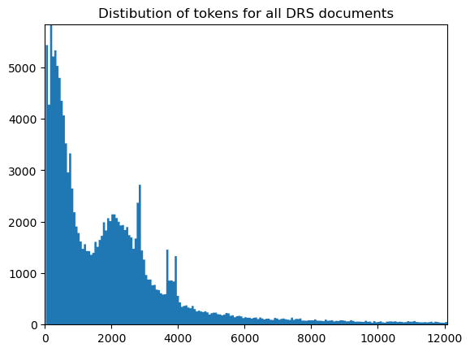

* *Word distribution for ADFINAL*: this one present a very odd distribution with its two bell-shaped multimodal. It woulbe be interresting to understand if those two modes correspond to two different patterns.

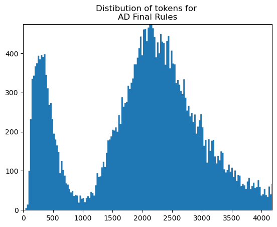

* *Word distribution for AC*: I was more surprised to see that the AC follows a classic exponential decrease, because I'm used to very very long ACs (AC27 and AC20).

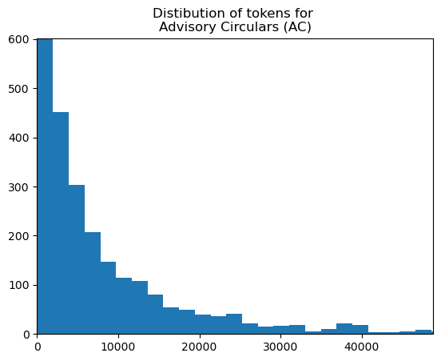

* *Word distribution for MMEL*: I was expecting a distribution concentrated around a single mode, but the MMEL distribution is more complex.

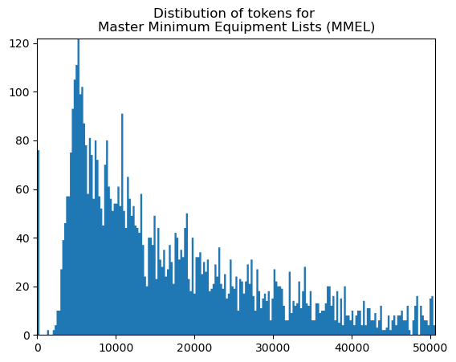

* *Word distribution for ORDERS*: Same comment as AC.

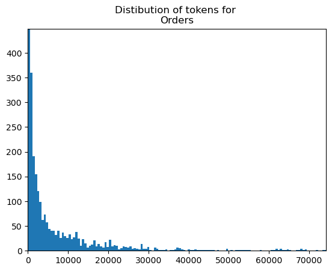

## ML applications
The size of the dataset makes the project intractable on my personal computer, so I decided to narrow-down the usage domain.

As far as I know there are several ways to work on a document with LLM : pass the document corpus in the context window (only available on cloud-based solutions - extremely resource intensive during training and inference), LLM fine-tuning (corpus is virtually stored in the weights - very resource intensive during training), RAG (corpus is stored in a flexible database - manageable with a personal computer).

I use the following format for the prompt:
* *role*: you are an expert in all aspects of operations, airworthiness and certification for rotorcraft and airplanes including maintenance and engineering.
* *task*: you provide detailed guidance to an applicant or an operator.
* *context*: rotorcraft and airplanes operations and airworthiness in United States National Airspace. You are using information from the following types of document: Aeronautical Information Publication (AIP), Aeronautical Information Manual (AIM), Advisory Circulars (AC), FAA Orders, FAA Order Handbooks, Federal Aviation Regulations (Title 14 CFR FAR).

### Working with a subset: AC, ORDER, HANDBOOK, AIP, AIM, FAR
The DRS database is made of various document types that do not belong to the same usage domain (e.g. space travels vs. civil flights). Some documents are also a mere database (e.f. PMA).

I decided to focus on a subset of core-engineering-aviation-knowledge documents. Those documents are also generally well written and contain detailed answers (important for LLM performance). The main issue is that I had to develop a manual tool to split those documents into sub-sections (also very important for LLM performance). This took me a while using regex, see [#92](./92_split_paragraphs.ipynb). Many of those documents (e.g. AC 29 which is about 1000 pages) deal with many topics.
* [Advisory Circulars](https://www.faa.gov/regulations_policies/advisory_circulars/) provide guidance to operators, maintainers, installers, applicants...
* [Orders](https://www.faa.gov/regulations_policies/orders_notices/) detail procedures that the FAA follows.
* [Handbooks](https://www.faa.gov/regulations_policies/handbooks_manuals) explain basic aeronautics knowledge.
* [Aeronautical Information Publication](https://www.faa.gov/air_traffic/publications/atpubs/aip_html/part1_gen_section_0.1.html) is basic airman knowledge.
* [Aeronautical Information Manual](https://www.faa.gov/air_traffic/publications/atpubs/aim_html/): is more basic airman knowledge.
* [Fereral Regulation](https://www.ecfr.gov/current/title-14): the US federal regulation.

I could have used other documents (TSO)... but that's already a good start.

We end up with the majority of documents below 5000 tokens (see histogram below), which is high but still manageable with RAGs with sparse encoding. We also have many documents below ~ 300 words which is good news also for performance (dense encoding). It is also obvious that there were several issues that led me with documents with an unacceptable number of words. I finally want to stress out that this dataset includes also historical (obsolete) documents.

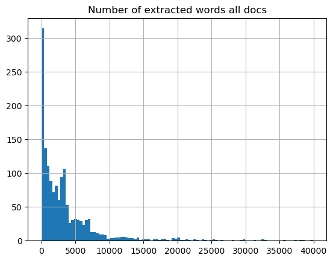

#### RAG
RAG is well-suited when there is a large and well-defined usage domain/corpus. It does better than a pure LLM hallucination ([Retrieval Augmentation Reduces Hallucination in Conversation](https://arxiv.org/abs/2104.07567)) and providing sourced answers (by design unlike LLMs). See [nlp book](https://www.oreilly.com/library/view/natural-language-processing/9781098136789/) for a good introduction.
I picked [haystack.deepset.ai](https://haystack.deepset.ai/) over other ones similar free solutions ([SciPhi-AI](https://github.com/SciPhi-AI/R2R), [LlamaIndex](https://www.llamaindex.ai/).

I initially explored options to fine-tune the LLM, but the cost even for a 7B LLM was not acceptable for a pet project. Most importantly I didn't have the appropriate data for fine-tuning and developping such a dataset was out of scope.

#### [Gemini](./55_Gemini.ipynb)

##### Zero-shot with no context window
I used the Gemini with no context to ask a series of aeronautic questions.

##### Zero-shot with context window
Gemini 1.5 accepts windows of 1M long tokens, which makes it possible to use the dataset from DRS or complete ACs. This approach proved to be a dead-end for understandable reasons (a LLM cannot compete with a vector database).

# Design Assurance
See [here](DESIGN_ASSURANCE.md).